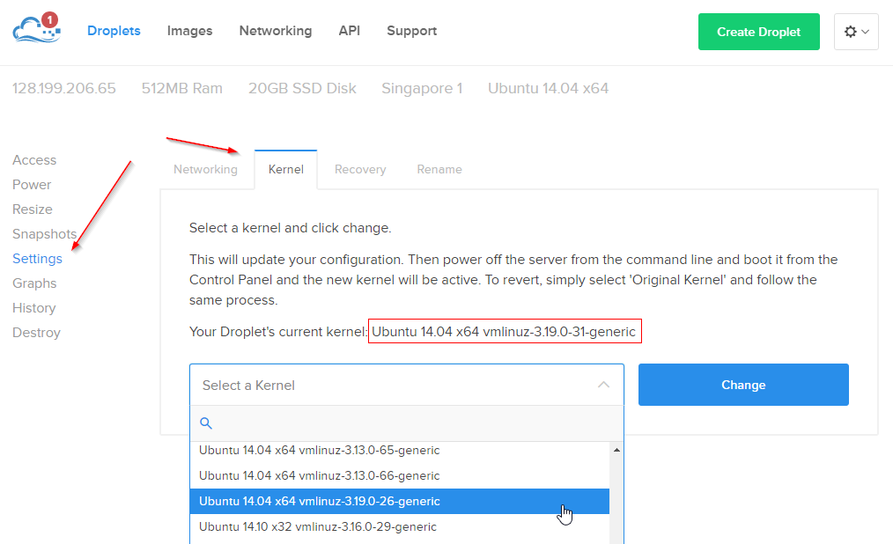

## Demo Script

### Prepare

Using ConEmu on windows:

* <kbd>CTRL</kbd>+<kbd>SHIFT</kbd>+<kbd>O</kbd> for horizontal split
* <kbd>CTRL</kbd>+<kbd>SHIFT</kbd>+<kbd>E</kbd> for vertical split

mount Windows host into CoreOS VM:

```
~core/mounthost.sh
```

go to local demo dir
```
cd /mnt/win/fundamentals/demo/
```

Handy docker daemon monitor at bottom:

```
watch -n .5 "/opt/bin/docker ps --format='table{{.Image}}\t{{.Names}}\t{{.Status}}\t{{.Ports}}'"
```

### Spinning up containers

Confirm docker is installed

```
docker
```

```
docker version
```

FYI, Processes running on host system

```
ps -aux | wc -l
```

Run a Debian container?

```
docker run -it debian bash
```

Confirm the distro

```
cat /etc/*-release
```
Packages installed?

```
dpkg -l | wc -l
```
<kbd>CTRL</kbd>+<kbd>D</kbd>

Fedora?

```
docker run -it --rm fedora bash
```

Confirm the distro

```
cat /etc/*-release
```
Packages installed

```
rpm -qa | wc -l
```

<kbd>CTRL</kbd>+<kbd>D</kbd>

How fast?

```
time docker run -dti ubuntu
```

stop & remove
```
docker stop -t 1 `docker ps -lq` && docker rm `docker ps -lq`
```

Run Ubuntu

```
docker run -it --rm ubuntu bash
```

Confirm the distro

```
cat /etc/*-release
```

Processes running within container

```
ps -aux
```

Packages installed

```
dpkg -l | wc -l
```

Install a new package

```
apt-get update && apt-get install zsh -y
```

<kbd>CTRL</kbd>+<kbd>D</kbd>

Docker allows to tag & share this new container.

### Build

Go to static web demo folder

```
cd staticweb/
```

Show Dockerfile contents

```
vim Dockerfile
```

Build the container

```
build -t so0k/web .
```

Run the container (detached and with all ports published on host)

```
docker run -d -P so0k/web
```

Change Text

```
vim Dockerfile

Add:
<p align="center"></p><p align="center">Hello Saigon, I am packaged in a container</p>

COPY saigon.jpg /usr/share/nginx/html/saigon.jpg
```

Re-build & Re-Run

Clean up

```
docker stop -t 1 <containers>
docker rm <containers>

docker images -f "dangling=true" -q | xargs docker rmi
```

### Ship and Run (Any Where)

Push
```
docker push so0k/web
```

Go to host in the cloud
```
ssh vdesmet@meetup.ludiino.com
```

I did pull ubuntu:14.04 in advance to speed demo up
```
docker images
```

PUll & Run the container

```
docker run -d -p 80:80 --name static_web so0k/web
```

[http://meetup.ludiino.com/](http://meetup.ludiino.com/)

Clean up

```
docker stop -t 1 static_web && docker rm static_web
```


### Docker Machine

```
doctl -k $DO_TOKEN d
```

```
docker-machine create -d digitalocean \
	--digitalocean-access-token $DO_TOKEN  \
	--digitalocean-region sgp1 prod
```

```
doctl -k $DO_TOKEN d
```

```
eval $(docker-machine env prod)
```

```
docker-machine ssh prod
```

copy files:
```
echo A file created locally! >foo.txt
docker-machine scp prod:/root/foo.txt

docker-machine ssh prod ls
```

### Docker Compose

Docker Compose on Windows!

```
docker-compose -v
```

Go to trainingwheels

```
cd trainingwheels
```

bring stack up

```
docker-compose up -d
```


### Docker Swarm

[See Setup](#manual-setup-of-docker-19) to set up your own cluster.

Get a Swarm token

```
docker run swarm create
```
token for demo: fe389f9b564f3a225fd45a4f65a7db8d

Create master (this will create docker 1.8.3 & swarm 0.4.0 on ubuntu 14.04 (3.13) )

```
docker-machine create -d digitalocean \
 --digitalocean-access-token $DO_TOKEN \
 --digitalocean-region sgp1 \
 --swarm \
 --swarm-master \
 --swarm-discovery token://fe389f9b564f3a225fd45a4f65a7db8d \
 swarm-master
```

Create Nodes

```
docker-machine create -d digitalocean \
 --digitalocean-access-token $DO_TOKEN \
 --digitalocean-region sgp1 \
 --swarm \
 --swarm-discovery token://fe389f9b564f3a225fd45a4f65a7db8d \
 swarm-node-00
```

Upgrade kernel, get docker 1.9 & swarm 1.0.0 set up.

Set env

```
eval $(docker-machine env --swarm swarm-master)
```

Show Swarm:

```
docker version
docker info
```

Show existing network:

```
docker network ls
```

Create new network with swarm (should create overlay by default?):

```
docker network create prod
docker network ls
```

Run containers:

```
docker run -itd --net=prod --name container1 ubuntu bash
docker run -itd --net=prod --name container2 ubuntu bash
docker run -itd --net=prod --name container3 ubuntu bash
```

Show Where the containers are running:

```
docker ps
```

Exec into the containers and confirm they can ping each other
No links, Accross Hosts..


### Manual Setup of Docker 1.9

Provision Ubuntu Droplet

Upgrade Kernel



Shutdown the droplet from the CLI, the new kernel will be selected when the droplet is turned back on (have to shut down).

```
docker-machine ssh swarm-master
docker-machine ssh swarm-node-00
```
Start a Distributed key-value store (for example, consul)

Download Consul (may need to `apt-get update && apt-get install unzip -y` first)
```
$ curl -OL https://dl.bintray.com/mitchellh/consul/0.5.2_linux_amd64.zip
$ unzip 0.5.2_linux_amd64.zip
$ mv consul /usr/local/bin/
$ rm 0.5.2_linux_amd64.zip
```

Better to use `screen` or `tmux` or deamonize the process

```
#master
consul agent -server -bootstrap -data-dir /tmp/consul -bind=128.199.175.75

#node
consul agent -data-dir /tmp/consul -bind=128.199.206.65
```

Join node to master

```
consul join 128.199.175.75
```

Set Docker daemon Options for cluster store (required for overlay network)

```
vim /etc/default/docker

#master:
DOCKER_OPTS='
-H tcp://0.0.0.0:2376
-H unix:///var/run/docker.sock
--cluster-store=consul://localhost:8500
--cluster-advertise=128.199.175.75:2376
--label=com.docker.network.driver.overlay.bind_interface=eth0
--storage-driver aufs
--tlsverify
--tlscacert /etc/docker/ca.pem
--tlscert /etc/docker/server.pem
--tlskey /etc/docker/server-key.pem
--label provider=digitalocean

'

#node:
DOCKER_OPTS='
-H tcp://0.0.0.0:2376
-H unix:///var/run/docker.sock
--cluster-store=consul://localhost:8500
--cluster-advertise=128.199.206.65:2376
--label=com.docker.network.driver.overlay.bind_interface=eth0
--label=com.docker.network.driver.overlay.neighbor_ip=128.199.175.75
--storage-driver aufs
--tlsverify
--tlscacert /etc/docker/ca.pem
--tlscert /etc/docker/server.pem
--tlskey /etc/docker/server-key.pem
--label provider=digitalocean

'
```


Stop Docker daemon and get v1.9-rc3 on both hosts

```
stop docker

docker mv /usr/bin/docker /usr/bin/docker-1.8.3
curl -Lo /usr/bin/docker  https://test.docker.com/builds/Linux/x86_64/docker-1.9.0-rc3
chmod +x /usr/bin/docker

start docker

```

Get docker logs to troubleshoot in case any errors 

(sometimes required to `curl -sSL https://get.docker.com/ | sh` again	)

```
tail -f /var/log/upstart/docker.log
```

```
docker info
```

Start swarm-agents

```
#node-00
docker run -d --restart=always --name swarm-agentv1 swarm:1.0.0-rc2 join \
 -advertise=128.199.206.65:2376 \
 token://fe389f9b564f3a225fd45a4f65a7db8d

#master
docker run -d --restart=always --name swarm-agentv1 swarm:1.0.0-rc2 join \
 -advertise=128.199.175.75:2376 \
 token://fe389f9b564f3a225fd45a4f65a7db8d

```

Start swarm-master

```
docker run -d \
 --restart=always \
 -v /etc/docker:/etc/docker \
 -p 3376:3376 \
 --name swarm-agent-masterv1 \
 swarm:1.0.0-rc2 \
 manage \
 --tlsverify \
 --tlscacert=/etc/docker/ca.pem \
 --tlscert=/etc/docker/server.pem \
 --tlskey=/etc/docker/server-key.pem \
 -H tcp://0.0.0.0:3376 \
 --strategy spread \
 token://fe389f9b564f3a225fd45a4f65a7db8d
```